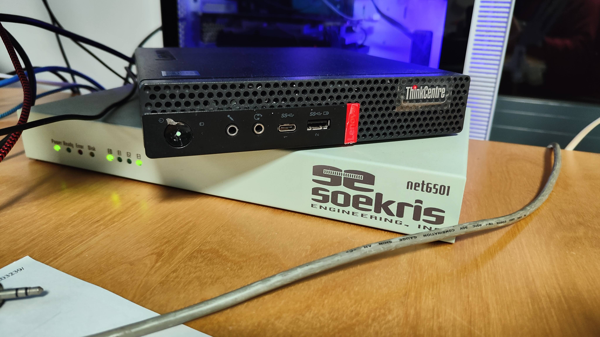

# 🖥 Self-hosting   Awesomeness 🦄

---
layout: center
---

# Why is self-hosting so popular lately? 🤔
---

# Easier than ever 🤡

---

# Cheaper than ever 🫰🏻

--- 

# And just because you can! (nerd! 🤓)

--- 

# What can you self-host?

<v-clicks>

- 📽️ Your legally bought and properly licensed backup copies of movies, series and music --> [YAMS.media](https://yams.media)
- 🤳🏻 Your pictures --> [immich](https://immich.app/)
- 👾 Your games --> [Sunshine](https://app.lizardbyte.dev/Sunshine/?lng=en)
- 🤖 Your home automation center --> [Home Assistant](https://www.home-assistant.io/)
- 📲 Your own applications and the self-hosting-friendly applications from others --> [Awesome Selfhosted web](https://awesome-selfhosted.net)
- 🌈 Anything!

</v-clicks>

--- 

# What do you need?

<v-clicks>

1. A way of running 🏃‍♂️ hosted applications
2. A way of storing 💾  the data needed by the hosting applications
3. A way of connect with your hosted applications 🛜
4. TIME 🕰️
5. **Commitment** 💪🏻 

</v-clicks>

--- 

# A way of running 🏃‍♂️ hosted applications

<v-clicks>

- KISS --> A linux distro + Docker
- YAGNI, but you'll learn a ton in the process --> K8s
- Oldie but goldie --> PROXMOX
- [QUESTION TO THE AUDIENCE] Any others? 

</v-clicks>

--- 

# A way of storing 💾  the data needed by the hosting applications

<v-clicks>

- KISS 
  - Just a big disk in the server you are using to run the thing
- YAGNI, but you'll learn a ton in the process 
  - A Distributed filesystem cluster like Ceph or IPFS
- A balanced option
  - A dedicated NAS, Off-the-shelf or custom
- Something that I'd really want to test in the near future
  - [Garage](https://garagehq.deuxfleurs.fr/), an OS distributed S3-compatible object storage that runs in crappy hardware
- [QUESTION TO THE AUDIENCE] Any others? 

</v-clicks>

---

# A way of connect with your hosted applications 🛜

<v-clicks>

- KISS
  - Tailscale
- YAGNI, but you'll learn a ton in the process 
  - Your custom connectivity solution. Some options:
    - OpenVPN based setup
    - Custom router based setup with a Firewall, port fordwarding, https certificates, etc.
    - WireGuard custom zerotrust solution 
- [QUESTION TO THE AUDIENCE] Any others? 

</v-clicks>

--- 

# Lessons learned 📝

<v-clicks>

- Start small!
- Enjoy the journey! 
- Full public cloud disconnection is not realistic: Keep one copy of the important data in the ☁
- A homelab is not PROD
- But, your children don't give a 💩 about it. MAKE it SOLID

</v-clicks>

---
layout: center
---

# Thanks 🙏🏻 QAs ☝🏻 + share your own experiences 🤕! 

